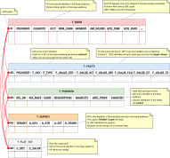
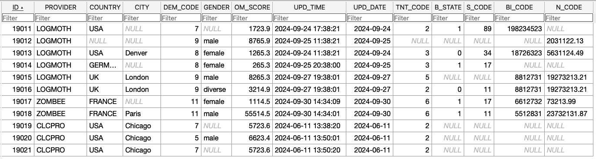
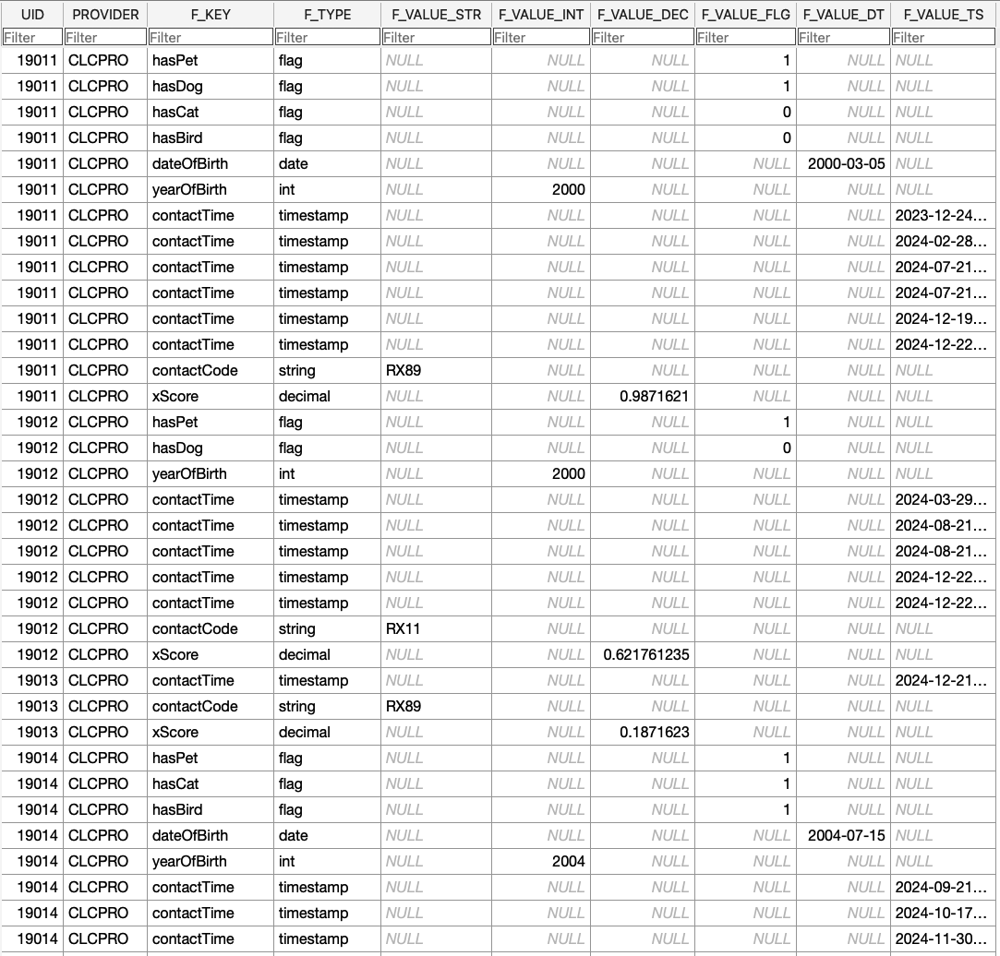
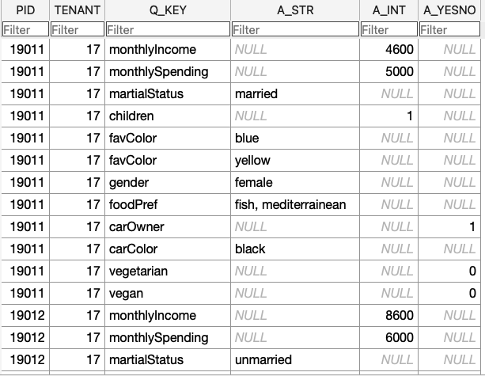
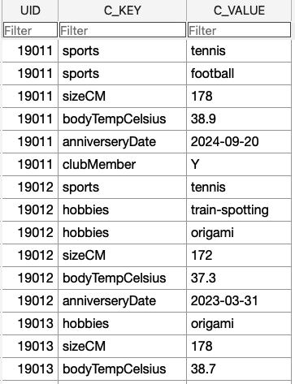

#### [Project Overview](../README.md)
----

# Mapping a table landscape

This article shows how to map your tables, so they can be queried using Audlang expressions. 

- [A simple mapping](#a-simple-mapping)
    - [Example 1](#example-1)
    - [Example 2](#example-2)
- [Adding the table T_FACTS](#adding-the-table-t_facts)
    - [Example 3](#example-3)
    - [Example 4](#example-4)
    - [Example 5](#example-5)
- [Adding the table T_POSDATA](#adding-the-table-t_posdata)
    - [Example 6](#example-6)
- [Adding the table T_SURVEY](#adding-the-table-t_survey)
    - [Example 7](#example-7)
- [Adding the table T_FLAT_TXT](#adding-the-table-t_flat_txt)
    - [Example 8](#example-8)
- [Further Reading](#further-reading)


Below, I use the same test tables and data I use for the **[H2](https://www.h2database.com/html/main.html)**-unit-tests during the build process. 



Here you can review the full data: [h2init.sql](../src/test/resources/h2init.sql).

All documentation examples can be found here: [H2DocumentationTest](../src/test/java/de/calamanari/adl/sql/cnv/H2DocumentationTest.java).

To keep the examples short I assume the following static imports for all examples below:
```java
import static de.calamanari.adl.cnv.tps.DefaultAdlType.BOOL;
import static de.calamanari.adl.cnv.tps.DefaultAdlType.DATE;
import static de.calamanari.adl.cnv.tps.DefaultAdlType.DECIMAL;
import static de.calamanari.adl.cnv.tps.DefaultAdlType.INTEGER;
import static de.calamanari.adl.cnv.tps.DefaultAdlType.STRING;
import static de.calamanari.adl.sql.DefaultAdlSqlType.SQL_BIGINT;
import static de.calamanari.adl.sql.DefaultAdlSqlType.SQL_BOOLEAN;
import static de.calamanari.adl.sql.DefaultAdlSqlType.SQL_DATE;
import static de.calamanari.adl.sql.DefaultAdlSqlType.SQL_DECIMAL;
import static de.calamanari.adl.sql.DefaultAdlSqlType.SQL_FLOAT;
import static de.calamanari.adl.sql.DefaultAdlSqlType.SQL_INTEGER;
import static de.calamanari.adl.sql.DefaultAdlSqlType.SQL_NUMERIC;
import static de.calamanari.adl.sql.DefaultAdlSqlType.SQL_SMALLINT;
import static de.calamanari.adl.sql.DefaultAdlSqlType.SQL_TIMESTAMP;
import static de.calamanari.adl.sql.DefaultAdlSqlType.SQL_TINYINT;
import static de.calamanari.adl.sql.DefaultAdlSqlType.SQL_VARCHAR;
```

## A simple mapping

Let's assume there is a table `T_BASE` holding the base audience.


This is a trivial mapping case because all attributes sit in columns of the same table side-by-side and `ID` is the primary key, so each record of your base audience can only appear once in this table. We will later see that this is an important information.

### Example 1
A first mapping could look as follows:

```java
SingleTableConfig BASE_TABLE1
 = SingleTableConfig.forTable("T_BASE")
         .idColumn("ID")
         .dataColumn("PROVIDER", SQL_VARCHAR).mappedToArgName("provider", STRING)
         .dataColumn("COUNTRY", SQL_VARCHAR).mappedToArgName("home-country", STRING)
         .dataColumn("CITY", SQL_VARCHAR).mappedToArgName("home-city", STRING)
         .dataColumn("DEM_CODE", SQL_INTEGER).mappedToArgName("demCode", INTEGER)
         .dataColumn("GENDER", SQL_VARCHAR).mappedToArgName("gender", STRING)
         .dataColumn("OM_SCORE", SQL_FLOAT).mappedToArgName("omScore", DECIMAL)
    .get();            
```

*Notes:*
 * The `idColumn` is mandatory, the actual name of that column is configurable. It will later be used to count or return IDs matching a query.
 * We do not need to map all columns, we can concentrate on the relevant ones.
 * Columns are defined and assigned to arguments of the logical data model. Both sides have types related to their "world".
 * The mapping above assumes that we don't have yet a logical data model, thus we must specify the ADL-types on the right. Alternatively, you can setup a logical model ([ArgMetaInfoLookup](https://github.com/KarlEilebrecht/audlang-java-core/tree/main/src/main/java/de/calamanari/adl/cnv/tps#readme)) *beforehand* and specify it initially. In this case you can omit the types on the right and concentrate on the SQL-types. See [SingleTableConfigTest](../src/test/java/de/calamanari/adl/sql/config/SingleTableConfigTest.java).

The expression `provider = LOGMOTH AND home-country = USA` produces:
```sql
SELECT DISTINCT ID
FROM T_BASE
WHERE ( ( COUNTRY = 'USA' )
        AND ( PROVIDER = 'LOGMOTH' )
        )
ORDER BY T_BASE.ID
```

The expression `(provider = LOGMOTH AND home-country = USA) OR omScore > 5000` produces:
```sql
SELECT DISTINCT ID
FROM T_BASE
WHERE ( ( OM_SCORE > 5000.0 )
        OR ( ( COUNTRY = 'USA' )
            AND ( PROVIDER = 'LOGMOTH' )
            )
        )
ORDER BY T_BASE.ID
```
:bulb: The [type-coalescence](type-coalescence.md) automatically aligns 5000 to decimal.


### Example 2

```java
SingleTableConfig BASE_TABLE
 = SingleTableConfig.forTable("T_BASE")
         .idColumn("ID")
         .dataColumn("PROVIDER", SQL_VARCHAR).mappedToArgName("provider", STRING)
         .dataColumn("COUNTRY", SQL_VARCHAR).mappedToArgName("home-country", STRING)
         .dataColumn("CITY", SQL_VARCHAR).mappedToArgName("home-city", STRING)
         .dataColumn("DEM_CODE", SQL_INTEGER).mappedToArgName("demCode", INTEGER)
         .dataColumn("GENDER", SQL_VARCHAR).mappedToArgName("gender", STRING)
         .dataColumn("OM_SCORE", SQL_FLOAT).mappedToArgName("omScore", DECIMAL)
         .dataColumn("UPD_TIME", SQL_TIMESTAMP).mappedToArgName("upd1", DATE)
         .dataColumn("UPD_DATE", SQL_DATE).mappedToArgName("upd2", DATE)
    .get();            
```

This time we map two additional columns. `UPD_TIME` is a timestamp and `UPD_DATE` is a date. By convention in Audlang we do not deal with time, so we must map both to type DATE.

The expression `provider = LOGMOTH AND upd1 = 2024-09-24 AND upd2 = 2024-09-24` produces:
```sql
SELECT DISTINCT ID
FROM T_BASE
WHERE ( ( PROVIDER = 'LOGMOTH' )
        AND ( (UPD_TIME >= TIMESTAMP '2024-09-24 00:00:00' AND UPD_TIME < TIMESTAMP '2024-09-25 00:00:00') )
        AND ( UPD_DATE = DATE '2024-09-24' )
        )
ORDER BY T_BASE.ID
```
:bulb: Here the advanced [type-coalescence](type-coalescence.md) detected that the underlying column UPD_TIME has a finer type resolution and created a range query.

However, there is a limitation, the following query does not return any rows: `provider = LOGMOTH AND upd1 = @upd2`.

```sql
SELECT DISTINCT ID
FROM T_BASE
WHERE ( ( PROVIDER = 'LOGMOTH' )
        AND ( UPD_TIME = UPD_DATE )
        )
ORDER BY T_BASE.ID
```

You can address this with *native type casting*, see chapter [Adding the table T_FLAT_TXT](#adding-the-table-t_flat_txt).

## Adding the table T_FACTS

One table, all attributes side-by-side is nice, but often your data sits in multiple tables. Let's add the table T_FACTS.



This table is a ***typed* key-value table**. Each member of your base audience can have as many facts as you like, even multiple entries for the same fact ([collection](https://github.com/KarlEilebrecht/audlang-spec/blob/main/doc/AudienceDefinitionLanguageSpecification.md#7-audlang-and-collection-attributes)) are possible. The table has one column `F_TYPE` that indicates the type of the fact, and depending on that column one of the subsequent columns of the matching type carries the value.

### Example 3

Let's start with the two boolean facts `hasCat` and `hasBird`:

```java
SingleTableConfig FACT_TABLE_BAD
 = SingleTableConfig.forTable("T_FACTS") 
         .idColumn("UID")
         .dataColumn("PROVIDER", SQL_VARCHAR)
              .mappedToArgName("fact.provider", STRING)
         .dataColumn("F_VALUE_FLG", SQL_BOOLEAN)
             .mappedToArgName("fact.hasCat.flg", BOOL)
             .filteredBy("F_KEY", SQL_VARCHAR, "hasCat")
             .filteredBy("F_TYPE", SQL_VARCHAR, "flag")
         .dataColumn("F_VALUE_FLG", SQL_BOOLEAN)
             .mappedToArgName("fact.hasBird.flg", BOOL)
             .filteredBy("F_KEY", SQL_VARCHAR, "hasBird")
             .filteredBy("F_TYPE", SQL_VARCHAR, "flag")
    .get();
```

That seems to be ok at first glance:

The query `fact.provider = CLCPRO AND (fact.hasCat.flg=1 OR fact.hasBird.flg=1)` translates to:

```sql
SELECT DISTINCT UID AS ID
FROM T_FACTS
WHERE ( ( PROVIDER = 'CLCPRO' )
        AND ( ( ( F_VALUE_FLG = TRUE AND F_KEY = 'hasCat' AND F_TYPE = 'flag' ) )
            OR ( ( F_VALUE_FLG = TRUE AND F_KEY = 'hasBird' AND F_TYPE = 'flag' ) )
            )
        )
ORDER BY ID
```

However, the query `fact.provider = CLCPRO AND fact.hasCat.flg=1 AND fact.hasBird.flg=1` does not return any result, although `19014` has indeed a bird and a cat.

*What went wrong?*

Let's look at the query:

```sql
SELECT DISTINCT UID AS ID
FROM T_FACTS
WHERE ( ( ( F_VALUE_FLG = TRUE AND F_KEY = 'hasCat' AND F_TYPE = 'flag' ) )
        AND ( ( F_VALUE_FLG = TRUE AND F_KEY = 'hasBird' AND F_TYPE = 'flag' ) )
        AND ( PROVIDER = 'CLCPRO' )
        )
ORDER BY ID
```

The first condition (hasCat) *fixes* the row, so the second condition (hasBird) cannot be met anymore.

The cause is called **[:point_right: multi-row problem](./multi-row-concept.md)** and requires additional meta-data so the query-builder will create a correct query.

```java
SingleTableConfig FACT_TABLE_MR
 = SingleTableConfig.forTable("T_FACTS") 
         .idColumn("UID")
         .dataColumn("PROVIDER", SQL_VARCHAR)
              .mappedToArgName("fact.provider", STRING)
         .dataColumn("F_VALUE_FLG", SQL_BOOLEAN)
             .mappedToArgName("fact.hasCat.flg", BOOL)
             .multiRow()
             .filteredBy("F_KEY", SQL_VARCHAR, "hasCat")
             .filteredBy("F_TYPE", SQL_VARCHAR, "flag")
         .dataColumn("F_VALUE_FLG", SQL_BOOLEAN)
             .mappedToArgName("fact.hasBird.flg", BOOL)
             .multiRow()
             .filteredBy("F_KEY", SQL_VARCHAR, "hasBird")
             .filteredBy("F_TYPE", SQL_VARCHAR, "flag")
    .get();
```

Now, the query `fact.provider = CLCPRO AND fact.hasCat.flg=1 AND fact.hasBird.flg=1` returns `19014` as expected.

```sql
WITH
sq__001 AS ( SELECT DISTINCT UID AS ID FROM T_FACTS WHERE ( F_VALUE_FLG = TRUE AND F_KEY = 'hasBird' AND F_TYPE = 'flag' ) ),
sq__002 AS ( SELECT DISTINCT UID AS ID FROM T_FACTS WHERE ( F_VALUE_FLG = TRUE AND F_KEY = 'hasCat' AND F_TYPE = 'flag' ) )
SELECT DISTINCT T_FACTS.UID AS ID
FROM T_FACTS
LEFT OUTER JOIN sq__001
    ON sq__001.ID = T_FACTS.UID
LEFT OUTER JOIN sq__002
    ON sq__002.ID = T_FACTS.UID
WHERE ( sq__001.ID IS NOT NULL
        AND sq__002.ID IS NOT NULL
        AND ( T_FACTS.PROVIDER = 'CLCPRO' )
        )
ORDER BY ID
```

The converter performs *existence checks* rather than simply combining the conditions on a single row.

Now, let's map the entire fact table:

```java
SingleTableConfig FACT_TABLE 
 = SingleTableConfig.forTable("T_FACTS") 
         .idColumn("UID")
         .dataColumn("PROVIDER", SQL_VARCHAR).mappedToArgName("fact.provider", STRING)
         .dataColumn("F_VALUE_STR", SQL_VARCHAR)
             .autoMapped(s-> (s.startsWith("fact.") && s.endsWith(".str") 
                  && s.length() > 9) ? s.substring(5, s.length()-4) : null, STRING)
             .multiRow()
             .filteredBy("F_KEY", SQL_VARCHAR, "${argName.local}")
             .filteredBy("F_TYPE", SQL_VARCHAR, "string")
         .dataColumn("F_VALUE_INT", SQL_BIGINT)
             .autoMapped(s-> (s.startsWith("fact.") && s.endsWith(".int") 
                  && s.length() > 9) ? s.substring(5, s.length()-4) : null, INTEGER)
             .multiRow()
             .filteredBy("F_KEY", SQL_VARCHAR, "${argName.local}")
             .filteredBy("F_TYPE", SQL_VARCHAR, "int")
         .dataColumn("F_VALUE_DEC", SQL_DECIMAL)
             .autoMapped(s-> (s.startsWith("fact.") && s.endsWith(".dec") 
                  && s.length() > 9) ? s.substring(5, s.length()-4) : null, DECIMAL)
             .multiRow()
             .filteredBy("F_KEY", SQL_VARCHAR, "${argName.local}")
             .filteredBy("F_TYPE", SQL_VARCHAR, "decimal")
         .dataColumn("F_VALUE_FLG", SQL_BOOLEAN)
             .autoMapped(s-> (s.startsWith("fact.") && s.endsWith(".flg") 
                  && s.length() > 9) ? s.substring(5, s.length()-4) : null, BOOL)
             .multiRow()
             .filteredBy("F_KEY", SQL_VARCHAR, "${argName.local}")
             .filteredBy("F_TYPE", SQL_VARCHAR, "flag")
         .dataColumn("F_VALUE_DT", SQL_DATE)
             .autoMapped(s-> (s.startsWith("fact.") && s.endsWith(".dt") 
                  && s.length() > 8) ? s.substring(5, s.length()-3) : null, DATE)
             .multiRow()
             .filteredBy("F_KEY", SQL_VARCHAR, "${argName.local}")
             .filteredBy("F_TYPE", SQL_VARCHAR, "date")
         .dataColumn("F_VALUE_TS", SQL_TIMESTAMP)
             .autoMapped(s-> (s.startsWith("fact.") && s.endsWith(".ts") 
                  && s.length() > 8) ? s.substring(5, s.length()-3) : null, DATE)
             .multiRow()
             .filteredBy("F_KEY", SQL_VARCHAR, "${argName.local}")
             .filteredBy("F_TYPE", SQL_VARCHAR, "timestamp")
    .get();
```

*Notes:*
 * Above, you see the **auto-mapping** feature, so you don't have to map each fact explicitly. It works rule-based. If the fact identifier has a certain format it will automatically be mapped to the corresponding column.

Finally, we create a `MultiTableConfig` to combine the two mappings into a single one:

```java
MultiTableConfig BASE_AND_FACTS 
 = MultiTableConfig.withTable(BASE_TABLE2)
                   .withTable(FACT_TABLE)
                .get();
```

### Example 4

With the previously created mapping we can now query *across* tables:

The expression `fact.provider = @provider AND fact.hasPet.flg=0` translates to:

```sql
WITH
sq__001 AS ( SELECT DISTINCT UID AS ID FROM T_FACTS WHERE ( F_VALUE_FLG = FALSE AND F_KEY = 'hasPet' AND F_TYPE = 'flag' ) )
SELECT DISTINCT sq__001.ID
FROM sq__001
LEFT OUTER JOIN T_BASE
    ON T_BASE.ID = sq__001.ID
    AND ( T_BASE.PROVIDER IS NOT NULL )
LEFT OUTER JOIN T_FACTS
    ON T_FACTS.UID = sq__001.ID
    AND ( T_FACTS.PROVIDER IS NOT NULL )
WHERE ( sq__001.ID IS NOT NULL
        AND ( T_FACTS.PROVIDER = T_BASE.PROVIDER )
        )
ORDER BY sq__001.ID
```
The expression `fact.provider = @provider OR fact.hasPet.flg=0` translates to:

```sql
WITH
bq__start AS ( SELECT T_FACTS.UID AS ID FROM T_FACTS INNER JOIN T_BASE ON T_FACTS.UID = T_BASE.ID WHERE ( T_FACTS.PROVIDER = T_BASE.PROVIDER )
        UNION SELECT UID AS ID FROM T_FACTS WHERE ( ( F_VALUE_FLG = FALSE AND F_KEY = 'hasPet' AND F_TYPE = 'flag' ) ) )
SELECT DISTINCT bq__start.ID
FROM bq__start
LEFT OUTER JOIN T_BASE
    ON T_BASE.ID = bq__start.ID
    AND ( T_BASE.PROVIDER IS NOT NULL )
LEFT OUTER JOIN T_FACTS
    ON T_FACTS.UID = bq__start.ID
    AND ( ( ( T_FACTS.F_VALUE_FLG = FALSE AND T_FACTS.F_KEY = 'hasPet' AND T_FACTS.F_TYPE = 'flag' ) )
        OR ( T_FACTS.PROVIDER IS NOT NULL )
    )
WHERE ( ( ( T_FACTS.F_VALUE_FLG = FALSE AND T_FACTS.F_KEY = 'hasPet' AND T_FACTS.F_TYPE = 'flag' ) )
        OR ( T_FACTS.PROVIDER = T_BASE.PROVIDER )
        )
ORDER BY bq__start.ID
```

*Why so complicated?*

The problem is that we did not tell the query builder enough about the table `T_BASE`. It does not know that the base table covers the base audience. Consequently, it must UNION all data to create a viable selection to start with.

Here is an improved configuration:

```java
SingleTableConfig BASE_TABLE_P = SingleTableConfig.forTable("T_BASE")
         .asPrimaryTable()
         .withUniqueIds()
         .idColumn("ID")
         .dataColumn("PROVIDER", SQL_VARCHAR).mappedToArgName("provider", STRING).alwaysKnown()
         .dataColumn("COUNTRY", SQL_VARCHAR).mappedToArgName("home-country", STRING)
         .dataColumn("CITY", SQL_VARCHAR).mappedToArgName("home-city", STRING)
         .dataColumn("DEM_CODE", SQL_INTEGER).mappedToArgName("demCode", INTEGER)
         .dataColumn("GENDER", SQL_VARCHAR).mappedToArgName("gender", STRING)
         .dataColumn("OM_SCORE", SQL_FLOAT).mappedToArgName("omScore", DECIMAL)
    .get();            
```

```java
MultiTableConfig BASE_AND_FACTS 
 = MultiTableConfig.withTable(BASE_TABLE_P)
                   .withTable(FACT_TABLE)
                .get();
```

This simplifies the query a lot:

```sql
SELECT DISTINCT T_BASE.ID
FROM T_BASE
LEFT OUTER JOIN T_FACTS
    ON T_FACTS.UID = T_BASE.ID
    AND ( ( ( T_FACTS.F_VALUE_FLG = FALSE AND T_FACTS.F_KEY = 'hasPet' AND T_FACTS.F_TYPE = 'flag' ) )
        OR ( T_FACTS.PROVIDER IS NOT NULL )
    )
WHERE ( ( ( T_FACTS.F_VALUE_FLG = FALSE AND T_FACTS.F_KEY = 'hasPet' AND T_FACTS.F_TYPE = 'flag' ) )
        OR ( T_FACTS.PROVIDER = T_BASE.PROVIDER )
        )
ORDER BY T_BASE.ID
```

See also **[:point_right:About the nature of tables and columns](table-column-nature.md)**.

### Example 5

Based on the previously created setup, the expression `fact.contactTime.ts < 2024-09-01 AND fact.hasPet.flg=1` translates to:

```sql
WITH
sq__001 AS ( SELECT DISTINCT UID AS ID FROM T_FACTS WHERE ( F_VALUE_TS < TIMESTAMP '2024-09-01 00:00:00' AND F_KEY = 'contactTime' AND F_TYPE = 'timestamp' ) ),
sq__002 AS ( SELECT DISTINCT UID AS ID FROM T_FACTS WHERE ( F_VALUE_FLG = TRUE AND F_KEY = 'hasPet' AND F_TYPE = 'flag' ) )
SELECT DISTINCT sq__001.ID
FROM sq__001
LEFT OUTER JOIN sq__002
    ON sq__002.ID = sq__001.ID
WHERE ( sq__001.ID IS NOT NULL
        AND sq__002.ID IS NOT NULL
        )
ORDER BY sq__001.ID
```

*Notes:*
 * As you can see, the primary table has been ignored because it is irrelevant for this query.
 * The WHERE-clause only contains existence checks, because this is a query on a key-value table. Due to the `AND` the first alias (`sq__001`) can serve as base query.
 * Keep in mind that `contactTime` is a *collection attribute*, see also [§7 Audlang Spec](https://github.com/KarlEilebrecht/audlang-spec/blob/main/doc/AudienceDefinitionLanguageSpecification.md#7-audlang-and-collection-attributes).

The expression `fact.contactTime.ts > 2024-11-13 OR fact.hasPet.flg=1` on the other hand is simpler because there is no `AND` between the conditions. Consequently, it translates to:

```sql
SELECT DISTINCT UID AS ID
FROM T_FACTS
WHERE ( ( ( F_VALUE_TS >= TIMESTAMP '2024-11-14 00:00:00' AND F_KEY = 'contactTime' AND F_TYPE = 'timestamp' ) )
        OR ( ( F_VALUE_FLG = TRUE AND F_KEY = 'hasPet' AND F_TYPE = 'flag' ) )
        )
ORDER BY ID
```

*Notes:*
 * The [type-coalescence](type-coalescence.md) has detected that the underlying data type has a finer resolution and adjusted the condition on the `contactTime` attribute.

## Adding the table T_POSDATA


This table is interesting because it can contain *multiple rows* per individual (record in the base audience), and the attributes in this table are *related*.

Consequently, the attributes are *not* collections in the classical sense. The best approach is a straight-forward mapping.

```java
SingleTableConfig POSDATA_TABLE = SingleTableConfig.forTable("T_POSDATA") 
         .idColumn("UID")
         .dataColumn("INV_DATE", SQL_DATE)
            .mappedToArgName("pos.date", DATE)
         .dataColumn("DESCRIPTION", SQL_VARCHAR)
            .mappedToArgName("pos.name", STRING)
         .dataColumn("QUANTITY", SQL_INTEGER)
            .mappedToArgName("pos.quantity", INTEGER)
         .dataColumn("UNIT_PRICE", SQL_DECIMAL)
            .mappedToArgName("pos.unitPrice", DECIMAL)
         .dataColumn("COUNTRY", SQL_VARCHAR)
            .mappedToArgName("pos.country", STRING)
    .get();

```

```java
MultiTableConfig BASE_AND_POSDATA 
 = MultiTableConfig.withTable(BASE_TABLE_P)
                   .withTable(POSDATA_TABLE)
                .get();
```

### Example 6

The expression `pos.country=@home-country and pos.date > 2024-04-01` asks for *"anybody who bought anything in its home country after first of April, 2024"*. 
It translates to:

```sql
SELECT DISTINCT T_BASE.ID
FROM T_BASE
INNER JOIN T_POSDATA
    ON T_POSDATA.UID = T_BASE.ID
    AND ( ( T_POSDATA.COUNTRY IS NOT NULL )
        OR ( T_POSDATA.INV_DATE > DATE '2024-04-01' )
    )
WHERE ( ( T_BASE.COUNTRY = T_POSDATA.COUNTRY )
        AND ( T_POSDATA.INV_DATE > DATE '2024-04-01' )
        )
ORDER BY T_BASE.ID
```

If we eliminate the home-country condition and query `pos.date > 2024-04-01`, the query gets even simpler.

```sql
SELECT DISTINCT UID AS ID
FROM T_POSDATA
WHERE ( INV_DATE > DATE '2024-04-01' )
```

On the other hand, if we query the opposite of the first query, namely `NOT (pos.country=@home-country AND pos.date > 2024-04-01)`, the related SQL becomes quite complex:

```sql
WITH
sq__001 AS ( SELECT T_BASE.ID FROM T_BASE INNER JOIN T_POSDATA ON T_BASE.ID = T_POSDATA.UID WHERE T_BASE.COUNTRY = T_POSDATA.COUNTRY ),
sq__002 AS ( SELECT ID FROM T_BASE WHERE COUNTRY IS NOT NULL ),
sq__003 AS ( SELECT UID AS ID FROM T_POSDATA WHERE COUNTRY IS NOT NULL ),
sq__004 AS ( SELECT UID AS ID FROM T_POSDATA WHERE INV_DATE > DATE '2024-04-01' ),
sq__005 AS ( SELECT UID AS ID FROM T_POSDATA WHERE INV_DATE IS NOT NULL )
SELECT DISTINCT T_BASE.ID
FROM T_BASE
LEFT OUTER JOIN sq__001
    ON sq__001.ID = T_BASE.ID
LEFT OUTER JOIN sq__002
    ON sq__002.ID = T_BASE.ID
LEFT OUTER JOIN sq__003
    ON sq__003.ID = T_BASE.ID
LEFT OUTER JOIN sq__004
    ON sq__004.ID = T_BASE.ID
LEFT OUTER JOIN sq__005
    ON sq__005.ID = T_BASE.ID
WHERE ( ( sq__002.ID IS NOT NULL AND sq__003.ID IS NOT NULL AND sq__001.ID IS NULL )
        OR ( T_BASE.COUNTRY IS NULL )
        OR ( sq__003.ID IS NULL )
    OR ( sq__005.ID IS NOT NULL AND sq__004.ID IS NULL )
        OR ( sq__005.ID IS NULL )
        )
ORDER BY T_BASE.ID
```
*Notes:*
 * The query-builder detected that apart from the condition on T_BASE (primary table) all other conditions must be covered by existence checks.

*What can we do if the user is interested in **any** invoice date?*

This is a bit tricky. The question *"Any purchase on a given date **and** some other condition"* can be interpreted in two ways:
 1. *some other condition* must be met *on this purchase event*
 2. *some other condition* is unrelated

As long as *some other condition* sits in a different table, it is always case (2). But if *some other condition* involves further columns of table `T_POSDATA`, it would be case (1)!

You might be tempted to mark the mapping for `INV_DATE` as multi-row to allow the queries like `pos.date = 2024-04-01 AND pos.date = 2024-04-02`. However, this would cause more problems than it solves because it *logically detaches* the attribute from its row-context. Further information related to this topic can be found here **[:point_right: About multi-row and sparse data](./multi-row-concept.md)**.

## Adding the table T_SURVEY



`T_SURVEY` is technically very similar to the table `T_FACTS`. The table has been added to the landscape to demonstrate **filtering and scoping on table-level**.

Here, we assume that the surveys belong to some *tenant*. We further assume that the *tenant* information cannot be influenced by the user and is thus not part of the expression. Instead, it comes from the current execution context or configuration. Nevertheless, the system must ensure that only rows from `T_SURVEY` will be considered if the column `TENANT` contains the *the current tenant* (here `17`).

```java
SingleTableConfig SURVEY_TABLE = SingleTableConfig.forTable("T_SURVEY")
         .filteredBy("TENANT", SQL_INTEGER, "${tenant}") 
         .idColumn("PID")
         .dataColumn("A_STR", SQL_VARCHAR)
             .autoMapped(s-> (s.startsWith("q.") && s.endsWith(".str") 
                     && s.length() > 6) ? s.substring(2, s.length()-4) : null, STRING)
             .multiRow()
             .filteredBy("Q_KEY", SQL_VARCHAR, "${argName.local}")
         .dataColumn("A_INT", SQL_BIGINT)
             .autoMapped(s-> (s.startsWith("q.") && s.endsWith(".int") 
                     && s.length() > 6) ? s.substring(2, s.length()-4) : null, INTEGER)
             .multiRow()
             .filteredBy("Q_KEY", SQL_VARCHAR, "${argName.local}")
         .dataColumn("A_YESNO", SQL_BOOLEAN)
             .autoMapped(s-> (s.startsWith("q.") && s.endsWith(".flg") 
                     && s.length() > 6) ? s.substring(2, s.length()-4) : null, BOOL)
             .multiRow()
             .filteredBy("Q_KEY", SQL_VARCHAR, "${argName.local}")
    .get();   
```

```java
MultiTableConfig BASE_AND_SURVEY 
 = MultiTableConfig.withTable(BASE_TABLE_P)
                   .withTable(SURVEY_TABLE)
                .get();
```

*Notes:*
 * Questions and answers of the survey are auto-mapped.
 * The line `.filteredBy("TENANT", SQL_INTEGER, "${tenant}")` above defines the column filter with a global variable.

### Example 7

We want to query `q.monthlyIncome.int > 5000` with the *current tenant*. 

The expression finally translates to:

```sql
SELECT DISTINCT PID AS ID
FROM T_SURVEY
WHERE ( ( A_INT > 5000 AND Q_KEY = 'monthlyIncome' AND TENANT = 17 ) )
ORDER BY ID
```

Please review [H2DocumentationTest](../src/test/java/de/calamanari/adl/sql/cnv/H2DocumentationTest.java) and [H2TestExecutionUtils](../src/test/java/de/calamanari/adl/sql/cnv/H2TestExecutionUtils.java) to understand how the information `tenant=17` gets into the process context.

## Adding the table T_FLAT_TXT



Here we assume that a table has quickly been onboard with raw key-value-data. Keys and values are just strings. The only thing we know is the UID, which is the identifier of the record in the base audience, so we can join the table with the others.

The mapping below demonstrates the power of **native type casting**:

```java
SingleTableConfig FLAT_TXT_TABLE = SingleTableConfig.forTable("T_FLAT_TXT")
             .idColumn("UID")
             .dataColumn("C_VALUE", SQL_VARCHAR).mappedToArgName("sports", STRING)
                 .multiRow()
                 .filteredBy("C_KEY", SQL_VARCHAR, "${argName}")
             .dataColumn("C_VALUE", SQL_VARCHAR).mappedToArgName("hobbies", STRING)
                 .multiRow()
                 .filteredBy("C_KEY", SQL_VARCHAR, "${argName}")
             .dataColumn("C_VALUE", 
             		SQL_INTEGER.withNativeTypeCaster(H2TestBindings.H2_VARCHAR_CASTER))
                 .mappedToArgName("sizeCM", INTEGER)
                 .multiRow()
                 .filteredBy("C_KEY", SQL_VARCHAR, "${argName}")
             .dataColumn("C_VALUE", 
             		SQL_DECIMAL.withNativeTypeCaster(H2TestBindings.H2_VARCHAR_CASTER))
                 .mappedToArgName("bodyTempCelsius", DECIMAL)
                 .multiRow()
                 .filteredBy("C_KEY", SQL_VARCHAR, "${argName}")
             .dataColumn("C_VALUE", 
             		SQL_BOOLEAN.withNativeTypeCaster(H2TestBindings.H2_VARCHAR_CASTER))
                 .mappedToArgName("clubMember", BOOL)
                 .multiRow()
                 .filteredBy("C_KEY", SQL_VARCHAR, "${argName}")
             .dataColumn("C_VALUE", 
             		SQL_DATE.withNativeTypeCaster(H2TestBindings.H2_VARCHAR_CASTER))
                 .mappedToArgName("anniverseryDate", DATE)
                 .multiRow()
                 .filteredBy("C_KEY", SQL_VARCHAR, "${argName}")
    .get();
```


*Notes:*
 * The type caster implementation for **[H2](https://www.h2database.com/html/main.html)** is part of [H2TestBindings](../src/test/java/de/calamanari/adl/sql/cnv/H2TestBindings.java). By intention this project does not contain any pre-defined implementations, because this code is - as the name states - tightly coupled to the database you are using. :bomb: It's a mine-field!
 * For performance reasons *native type casting* should only be used temporily or when testing raw data. The *tortured sql* has surely a negative impact on the efficiency of any DB-indexes!

By intention there are a couple of challenges in this scenario related to the (non-existing) data types. If you query `sizeCM > 90` you expect `178` to match. A string comparison would not do the job. The type casting ensures that the values onboarded as strings will be compared as integers during the selection.

### Example 8

The query `sizeCM between (185, 195)` translates to:

```sql
WITH
bq__start AS ( SELECT UID AS ID FROM T_FLAT_TXT WHERE ( ( CAST(C_VALUE AS INT) < 195 AND C_KEY = 'sizeCM' ) ) OR ( ( CAST(C_VALUE AS INT) = 195 AND C_KEY = 'sizeCM' ) ) ),
sq__001 AS ( SELECT DISTINCT UID AS ID FROM T_FLAT_TXT WHERE ( CAST(C_VALUE AS INT) < 195 AND C_KEY = 'sizeCM' ) ),
sq__002 AS ( SELECT DISTINCT UID AS ID FROM T_FLAT_TXT WHERE ( CAST(C_VALUE AS INT) = 195 AND C_KEY = 'sizeCM' ) ),
sq__003 AS ( SELECT DISTINCT UID AS ID FROM T_FLAT_TXT WHERE ( CAST(C_VALUE AS INT) > 185 AND C_KEY = 'sizeCM' ) ),
sq__004 AS ( SELECT DISTINCT UID AS ID FROM T_FLAT_TXT WHERE ( CAST(C_VALUE AS INT) = 185 AND C_KEY = 'sizeCM' ) )
SELECT DISTINCT bq__start.ID
FROM bq__start
LEFT OUTER JOIN sq__001
    ON sq__001.ID = bq__start.ID
LEFT OUTER JOIN sq__002
    ON sq__002.ID = bq__start.ID
LEFT OUTER JOIN sq__003
    ON sq__003.ID = bq__start.ID
LEFT OUTER JOIN sq__004
    ON sq__004.ID = bq__start.ID
WHERE ( ( sq__001.ID IS NOT NULL
            OR sq__002.ID IS NOT NULL
            )
        AND ( sq__003.ID IS NOT NULL
            OR sq__004.ID IS NOT NULL
            )
        )
ORDER BY bq__start.ID
```

This also works with decimals. The query `bodyTempCelsius between (38, 39.1)` translates to:

```sql
WITH
bq__start AS ( SELECT UID AS ID FROM T_FLAT_TXT WHERE ( ( CAST(C_VALUE AS DECIMAL(10,2)) < 39.1 AND C_KEY = 'bodyTempCelsius' ) ) OR ( ( CAST(C_VALUE AS DECIMAL(10,2)) = 39.1 AND C_KEY = 'bodyTempCelsius' ) ) ),
sq__001 AS ( SELECT DISTINCT UID AS ID FROM T_FLAT_TXT WHERE ( CAST(C_VALUE AS DECIMAL(10,2)) < 39.1 AND C_KEY = 'bodyTempCelsius' ) ),
sq__002 AS ( SELECT DISTINCT UID AS ID FROM T_FLAT_TXT WHERE ( CAST(C_VALUE AS DECIMAL(10,2)) = 39.1 AND C_KEY = 'bodyTempCelsius' ) ),
sq__003 AS ( SELECT DISTINCT UID AS ID FROM T_FLAT_TXT WHERE ( CAST(C_VALUE AS DECIMAL(10,2)) > 38.0 AND C_KEY = 'bodyTempCelsius' ) ),
sq__004 AS ( SELECT DISTINCT UID AS ID FROM T_FLAT_TXT WHERE ( CAST(C_VALUE AS DECIMAL(10,2)) = 38.0 AND C_KEY = 'bodyTempCelsius' ) )
SELECT DISTINCT bq__start.ID
FROM bq__start
LEFT OUTER JOIN sq__001
    ON sq__001.ID = bq__start.ID
LEFT OUTER JOIN sq__002
    ON sq__002.ID = bq__start.ID
LEFT OUTER JOIN sq__003
    ON sq__003.ID = bq__start.ID
LEFT OUTER JOIN sq__004
    ON sq__004.ID = bq__start.ID
WHERE ( ( sq__001.ID IS NOT NULL
            OR sq__002.ID IS NOT NULL
            )
        AND ( sq__003.ID IS NOT NULL
            OR sq__004.ID IS NOT NULL
            )
        )
ORDER BY bq__start.ID
```

Finally, please note that the values for `clubMember` are `Y` (for yes, true) resp. `N` (for no, false) in the table, but because of the mapping, you can query them like any other boolean flag (`0`vs. `1`, see [§2.2 Audience Language Specification](https://github.com/KarlEilebrecht/audlang-spec/blob/main/doc/AudienceDefinitionLanguageSpecification.md#22-logical-values)).

The query `clubMember = 1` translates to:

```sql
SELECT DISTINCT UID AS ID
FROM T_FLAT_TXT
WHERE ( ( CASE WHEN C_VALUE = 'Y' THEN TRUE WHEN C_VALUE = 'N' THEN FALSE ELSE NULL END = TRUE AND C_KEY = 'clubMember' ) )
ORDER BY ID
```


## Further Reading
* **[About the nature of tables and columns](table-column-nature.md)**
* [H2DocumentationTest](../src/test/java/de/calamanari/adl/sql/cnv/H2DocumentationTest.java) contains all the examples from this article.
* [H2TestExecutionUtils](../src/test/java/de/calamanari/adl/sql/cnv/H2TestExecutionUtils.java): This class hides a few details to avoid boiler-plate code in the tests. Please review.
* [h2init.sql](../src/test/resources/h2init.sql) contains the test data.
* [H2TestBindings](../src/test/java/de/calamanari/adl/sql/cnv/H2TestBindings.java) shows a couple of typical and unusual bindings based on the aforementioned tables.
* [Configuration](../src/main/java/de/calamanari/adl/sql/config/README.md): Technical details about the configuration options.
* [Conversion](../src/main/java/de/calamanari/adl/sql/cnv/README.md): Technical details about SQL-conversion.