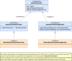

#### [Project Overview](../../../../../../../README.md)
----

# package sql

----

The package **sql** contains the basic classes for converting a **[CoreExpression](https://github.com/KarlEilebrecht/audlang-java-core/tree/main/src/main/java/de/calamanari/adl/irl/README.md)** into an SQL-script to be executed as a **Prepared Statement** (JDBC). Further details can be found in the sub-packages **[config](./config/README.md)** (configuration of the data binding) and **[cnv](./cnv/README.md)** (converter and supplementary classes).

The [conversion process](./cnv/README.md) follows the structure of the given [CoreExpression](https://github.com/KarlEilebrecht/audlang-java-core/blob/main/src/main/java/de/calamanari/adl/irl/README.md) to turn every MatchExpression into a [MatchCondition](./cnv/MatchCondition.java). Therefore the converter visits every level (AND/OR) and every leaf of the expression's DAG. Although this process is deterministic, obviously the order of the condition creation does not necessarily match the order of appearance in the final SQL-script.

This leads to a problem: To avoid [SQL-injection](https://en.wikipedia.org/wiki/SQL_injection) vulnerabilities, JDBC creates a parameter for each value potentially stemming from user input. These parameters are expected to be represented as question marks '?' in an input SQL-script for a JDBC PreparedStatement. The PreparedStatement instance provides setters to fill-in these **positional parameter** values in a subsequent step. So, a parameters position is the key to set its value. As mentioned before and depicted in the image above the creation of conditions (and thus parameters) can happen anytime throughout the conversion process. Because of some late decisions it is not even guaranteed that all generated parts will appear in the final SQL. There is no connection between parameters and their positions until the script is complete.

The solution to this problem is decoupling *creation* and *application* of parameters. A [QueryParameterCreator](./QueryParameterCreator.java) is responsible for validating and preparing the value of a parameter to be set. Later, the [QueryParameterApplicator](./QueryParameterApplicator.java) sets the parameter on the PreparedStatement. Between these two steps parameters are collected in order of creation. To eventually identify a parameter and place it correctly in the created script, each parameter has a unique identifier. While the SQL-script is under construction, parameters do not appear as question marks in the script draft but as placeholders `${id}`. Once the final structure of the SQL-script is clear, a [QueryTemplateWithParameters](./QueryTemplateWithParameters.java) will be created leveraging a [QueryTemplateParser](./QueryTemplateParser.java) to replace the placeholders with question marks.

This template can then be applied to a PreparedStatement to be executed.

## Class overview

 * **[AdlSqlType](AdlSqlType.java)**: Extending [AdlType](https://github.com/KarlEilebrecht/audlang-java-core/tree/main/src/main/java/de/calamanari/adl/cnv/tps/README.md), AdlSqlTypes share common semantics with ADL-types (such as formatting and native type casting) but add features related to native SQL-types. By ***type decoration*** you can easily create custom type based on a given type with adjusted behavior.
 * **[DefaultAdlSqlType](DefaultAdlSqlType.java)**: This enumeration represents the standard JDBC types as [AdlSqlTypes](AdlSqlType.java). Usually, these types (or decorated siblings) should be sufficient to map a given table landscape.
 * **[DefaultSqlFormatter](DefaultSqlFormatter.java)**: This enumeration contains the ArgValueFormatters for the [DefaultAdlSqlTypes](DefaultAdlSqlType.java). These formatters usually only come into play when debugging scripts because a regularly executed script leverages a PreparedStatement and parameters, so that formatting is not required. However, the formatters are extremely helpful because they ensure any script printed to the log for debugging purposes is readable and valid to be executed.
 * **[DefaultQueryParameter](DefaultQueryParameter.java)** is the default implementation of a query parameter. It supports the types defined by [DefaultAdlSqlType](DefaultAdlSqlType.java).
 * **[DefaultQueryParameterCreator](DefaultQueryParameterCreator.java)** is the default implementation of a parameter creator. It has built-in support for basic **[automatic type coalescence](../../../../../../../doc/type-coalescence.md)**.
 * **[DefaultQueryParameterApplicator](DefaultQueryParameterApplicator.java)** is the counterpart of [DefaultQueryParameterCreator](DefaultQueryParameterCreator.java). It can apply the parameters to PreparedStatements or (as formatted values) to plain scripts for debugging.
 * **[QueryTemplateParser](QueryTemplateParser.java)** reads a script with `${id}` parameter placeholders to call a listener with the exact positions. The callbacks allow to create a **[QueryTemplateWithParameters](./QueryTemplateWithParameters.java)** where all parameters appear as question marks (positional parameters). 
 * **[QueryType](QueryType.java)** is an enumeration of the standard ways to build a query (e.g., influences SELECT and ORDER BY). Default query types are:
   * Count records matching an expression.
   * Select record-IDs matching an expression.
   * Select ordered record-IDs matching an expression.
 * **[SqlFormatConstants](SqlFormatConstants.java)** and **[SqlFormatUtils](SqlFormatUtils.java)** contain constants and utility methods reused across the project to avoid duplication and increase code readability.

## Further Reading
 * **[Configuration](./config/README.md)** - This package contains data structures and utilities to create a [DataBinding](./config/DataBinding.java) with the mapping to an underyling physical table landscape.
 * **[Conversion](./cnv/README.md)** - In this package you find the extendable conversion framework with the [DefaultSqlExpressionConverter](./cnv/DefaultSqlExpressionConverter.java).
 * To get a better idea of the function of the classes in this package, please review related tests (e.g., [DefaultAdlSqlTypeTest](../../../../../../test/java/de/calamanari/adl/sql/DefaultAdlSqlTypeTest.java), [DefaultQueryParameterCreatorTest](../../../../../../test/java/de/calamanari/adl/sql/DefaultQueryParameterCreatorTest.java), [QueryTemplateWithParametersTest](../../../../../../test/java/de/calamanari/adl/sql/QueryTemplateWithParametersTest.java)).

