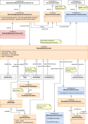
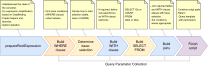
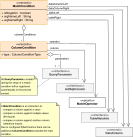
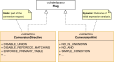

#### [Project Overview](../../../../../../../../README.md) | [package sql](../README.md)
----

# package cnv (SQL-Conversion)

----

The package **cnv** contains the conversion classes to transform a given CoreExpression into an SQL-script.

To convert an expression the converter *visits* all levels of the expression determining the correct combination of conditions. Because the leaf-expressions of any CoreExpression define the main conditions to be included in the corresponding SQL-statement, the current implementation starts with building the WHERE-clause while it collects information which columns can be directly compared against values and where (additional) existence checks are required. Here the configured [DataBinding](../config/DataBinding.java) plays an important role.

Finally, the collected SQL-parts get combined into a single SQL-statement. This script together with the collected parameters form the [QueryTemplateWithParameters](../QueryTemplateWithParameters.java) to be returned by the [DefaultSqlExpressionConverter](DefaultSqlExpressionConverter.java).

The process state of an SQL-conversion is quite complex and has been separated into the **local context** (per expression level as known from other converter implementations) and a **global context** with settings, variables and findings.

Every level context instance [SqlConversionContext](SqlConversionContext.java) has a reference to the global [SqlConversionProcessContext](SqlConversionProcessContext.java). This makes it easier for different components to access the configuration. Via the mutable context steps can forward data to later steps. The process context covers the complete state of the conversion. This was decided to allow passing this state around without passing the converter instance itself.

If required, there is a way to tweak the generated SQL-script without extending the converter implementation: the **[SqlAugmentationListener](SqlAugmentationListener.java)**. By implementing this interface and registering your custom listener with the converter, you can apply native database hints or even change the type of a join for a particular table combination. This is also the intended way to extend an SQL-query **beyond querying IDs** (e.g., turning the main query into a sub-select).

Additionally, most of the key features (factories, helpers, etc.) are implemented in a way that they can be extended or replaced if the existing conversion does not meet your requirements.

## Class overview

 * **[SqlConversionProcessContext](SqlConversionProcessContext.java)** is the global context for a single conversion execution. The **[ResettableScpContext](ResettableScpContext.java)** ensures that you can configure a converter once and run multiple conversions subsequently. State related to a previous run cannot accidentally leak into the next run. As the name states, the reset restores the settings that were provided initially.
 * **[SqlConversionContext](SqlConversionContext.java)** is an extended form of a ConversionContext (context of the given expression level with some additional features. Each SqlConversionContext has a reference to the *global* [SqlConversionProcessContext](SqlConversionProcessContext.java). This gets injected into the level context by the converter whenever a level context instance is created.
 * **[AbstractSqlExpressionConverter](AbstractSqlExpressionConverter.java)** contains most of the (reusable) features required for the conversion (e.g., appending joins). This class has a large number of methods that allow for changing details by subclassing without touching the overall structure. A couple of convenience methods provide quick access to common features to keep the related code short (e.g., `stats()` and `aliasHelper()`). I introduced this abstraction for two reasons: 
   1. This class got (and is still, sigh ...) too fat. :shrug: 
   2. In my concrete [DefaultSqlExpressionConverter](DefaultSqlExpressionConverter.java) implementation I wanted to concentrate on the *structure of the SQL-script* to be created without being distracted by tons of supplementary methods. So, if anybody generally wants to stick with my approach but needs to apply modifications then she can subclass [DefaultSqlExpressionConverter](DefaultSqlExpressionConverter.java). On the otherhand, if she wants a completely different SQL-structure but likes the given "infrastructure", then sub-classing the [AbstractSqlExpressionConverter](AbstractSqlExpressionConverter.java) may be the right way to start.
 * **[DefaultSqlExpressionConverter](DefaultSqlExpressionConverter.java)** is the default implementation of a general purpose SQL-converter. I prefer WITH over complex sub-selections. Thus, this converter always starts with a base selection, and *every* join (be it inner or outer) is connected to this base selection.
 * **[AliasHelper](AliasHelper.java)**: For the conditions collected while traversing the CoreExpression the alias helper keeps track of them. Each **[ExpressionAlias](ExpressionAlias.java)** is a **positive condition** (such as `color = red` or `color any of (red, green, blue`). The alias helper ensures that there is only one alias for the same expression. Each alias knows if there were negative references, positive references or both contained in the root expression. With this information about each concrete condition we can later decide how to join a table.
 * **[CoreExpressionSqlHelper](CoreExpressionSqlHelper.java)**: This helper concentrates the knowledge about a given root expression. Initially, it gathers statistics: [CoreExpressionStats](CoreExpressionStats.java). These statistics are available throughout the process. The most important so-called [ConversionHint](ConversionHint.java)s also get added to the **global flags** to simplify checks across the conversion process. Additionally, the [CoreExpressionSqlHelper](CoreExpressionSqlHelper.java) provides a number of utilities related to working with CoreExpressions in the context of the SQL-generation.
 * **[MatchCondition](MatchCondition.java)**: A MatchCondition is an instruction to compare a column against a value, to compare a column against multiple values (IN-clause) or to compare a column against another column (reference match).

   

   Due to configured [FilterColumns](../config/FilterColumn.java) there can be multiple [ColumnConditions](ColumnCondition.java) associated with a single match condition. Each **[ColumnCondition](ColumnCondition.java)** defines the concrete comparison of a database column against a *value*. Consequently, reference matches don't have column conditions if there are no additional [FilterColumns](../config/FilterColumn.java) configured. Please note that the registration of the related [QueryParameters](../QueryParameter.java) in the process context happens right after creation inside the code of [MatchCondition](MatchCondition.java).
 * **[ConversionDirective](ConversionDirective.java)** is an enumeration of directives that can be passed into the conversion process to control certain details. Like [ConversionHints](ConversionHint.java), directives are technically flags.
 
   
   
   Hints get computed based on the given expression. Directives are part of the conversion request setup. For example, if you don't like UNIONs as a base selection then you can set the corresponding directive [ConversionDirective.**DISABLE_UNION**](ConversionDirective.java).
 * **[SqlAugmentationListener](SqlAugmentationListener.java)** is an interface for components that want to *intercept* an ongoing SQL-generation process. Several callbacks (including the context and the statement StringBuilder) allow to apply native hints or even modifications. The listener has always full access to the [process context](./SqlConversionProcessContext.java). For example, if you want to create additional query parameters you can leverage the utilities from the context (don't forget to register them in the process context). Then your parameters will appear in the final script along with those created by the converter.

## Further Reading
 * **Unit tests**: In the corresponding test package you can find tests related to the classes in this package, e.g.:   
   * [MatchConditionTest](../../../../../../../test/java/de/calamanari/adl/sql/cnv/MatchConditionTest.java)
   * [DefaultSqlExpressionConverterTest](../../../../../../../test/java/de/calamanari/adl/sql/cnv/DefaultSqlExpressionConverterTest.java)  
 * **H2-Tests**: This project uses an in-memory [H2-database](https://www.h2database.com/html/main.html) to ensure the generated SQLs are executable.
   * [DefaultSqlExpressionConverterBasicH2Test](../../../../../../../test/java/de/calamanari/adl/sql/cnv/DefaultSqlExpressionConverterBasicH2Test.java)
   * [DefaultSqlExpressionConverterComplexH2Test](../../../../../../../test/java/de/calamanari/adl/sql/cnv/DefaultSqlExpressionConverterComplexH2Test.java)
   * [H2TestExecutionUtils](../../../../../../../test/java/de/calamanari/adl/sql/cnv/H2TestExecutionUtils.java)
   * Test data setup: [h2init.sql](../../../../../../../test/resources/h2init.sql)
 * **[TestCommentAugmentationListener](../../../../../../../test/java/de/calamanari/adl/sql/cnv/TestCommentAugmentationListener.java)** is a small implementation to demonstrate how you can intercept the SQL-generation process to augment any generated script.

