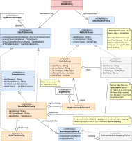

#### [Project Overview](../../../../../../../../README.md) |  [package sql](../README.md)
----

# package config (Data Binding Configuration)

----

The package **config** contains all the features to setup a [DataBinding](DataBinding.java) which connects the argument names used in an Expression to an underlying table landscape.

The mapping approach makes as little assumptions about the existing physical data model as possible. Thus, it fits a scenario where all attributes are organized perfectly side-by-side in a single large table but also the opposite, a large key-value-table.

The only preliminary hard assumptions we make here is that tables are connected by a single ID-field. In other words: there is no support for composite foreign keys. The name of the ID-column may vary from table to table.

Because the setup of a mapping can be tedious the central classes have **fluent APIs** to keep configurations short and easy to read.

## Class overview

 * **[DataBinding](DataBinding.java)** is a container for the table configuration and the only structural SQL-dialect specific information, the **[SqlContainsPolicy](SqlContainsPolicy.java)**. Unfortunately, the way to express an [Audlang CONTAINS-operation](https://github.com/KarlEilebrecht/audlang-spec/blob/main/doc/AudienceDefinitionLanguageSpecification.md#36-contains-text-snippet) in SQL varies drastically between database vendors. Usually, one will apply the SQL `LIKE` syntax. But even that varies! For safety reasons we must pass the string entered by a user as a parameter. The concatenation to build the LIKE-pattern must happen in the SQL. This concatenation is again vendor-specific. Plus, there are subtle differences whether any (unintended) wildcard (e.g. `%` or `_`) will survive this process or will be escaped or worst case may break the SQL-syntax. The [SqlContainsPolicy](SqlContainsPolicy.java) provides the chance to adjust the exact format to the individual needs in a given environment. 
    * The enumeration **[DefaultSqlContainsPolicy](DefaultSqlContainsPolicy.java)** covers a couple of standard databases. As already known from the Audlang type system, the policies also allow for **adjustment by decoration**. You can quickly create a custom policy based on an existing one.
 * **[DataTableConfig](DataTableConfig.java)**: This interface describes the configuration of a scenario with a single table or multiple tables.
 * **[TableMetaInfo](TableMetaInfo.java)** describes the key elements and characteristics of a single table.
 * **[TableNature](TableNature.java)**: This enumeration allows to describe some key characteristics of a table with a single label. E.g., if a table has all IDs, and each ID appears exactly once, then its *nature* would be `ALL_IDS_UNIQUE`. The nature of a table has critical influence on query building. See also [:point_right: About the nature of tables and columns](../../../../../../../../doc/table-column-nature.md).
 * **[SingleTableConfig](SingleTableConfig.java)** describes a single table. If you want to compose a scenario with multiple tables you can either first setup all SingleTableConfigs to combined them later, or you use the fluent API of the [MultiTableConfig](SingleTableConfig.java). Mixing is also possible.
 * **[MultiTableConfig](MultiTableConfig.java)** describes a setup with one or multiple tables. It is a wrapper around a list of [SingleTableConfigs](SingleTableConfig.java).
   * There is a built-in consistency check that the same attribute (argName) cannot be mapped to multiple columns (across all member tables).
   * In case there are muliple tables with [AutoMappingPolicy](AutoMappingPolicy.java) then these rules will be *probed* in order of configuration.
 * **[AdlSqlColumn](AdlSqlColumn.java)** is the common interface of all configured columns in a [DataTableConfig](DataTableConfig.java), [DataColumns](DataColumn.java) and [FilterColumns](FilterColumn.java).
 * **[DataColumn](DataColumn.java)** defines a column that holds physical attribute values, e.g., "red" for the argName "color" plus additional column characteristics. These can include [FilterColumns](FilterColumn.java). The same column can occur multiple times within the same configuration, mapped to different argNames. The [AdlSqlType](../AdlSqlType.java) of the data column decides about the way the conditions from a query will be converted into parameters of a PreparedStatement.
 * **[FilterColumn](FilterColumn.java)** is a column that does not contain any data related to argNames but acts as an *additional constraint*.
   | ID   | DATA_COLUMN | ARG_NAME |
   |------|-------------|----------|
   | 3245 | red         | color    |
   | 3245 | circle      | shape    |
   | 3245 | yes         | q234     |

   The simplest example would be a key-value table (see above), where the [DataColumn](DataColumn.java) is always the same and a [FilterColumn](FilterColumn.java) holding the argName acts as an additional filter. This way, multiple argNames can be mapped to the same column. 
   * [FilterColumns](FilterColumn.java) can have *static or dynamic values*. If you specify a variable `${org}` as filter value or a combination like `${org}/${section}` then these variables will be replaced at execution time with the corresponding global variable from the process context. 
   * There are two special variables `${argName}` and `${argName.local}`. The variable `${argName}` contains the name of the attribute currently being mapped. `${argName.local}` is only valid in the context of an [AutoMappingPolicy](AutoMappingPolicy.java) and contains some value *derived* from the argName.
   * Filter columns can be defined for a single column or for an entire table. In the latter case *every* query involving the related table will automatically include the filter column condition. E.g., your table has a `TENANT` column, then you could define a filter column condition with the filter value `${tenant}` and put the `tenant`-variable in the process context (e.g., `tenant=4711`). This way only data related to tenant 4711 can be queried from that table.
   * [FilterColumns](FilterColumn.java) are regular [AdlSqlColumns](AdlSqlColumn.java) with an [AdlSqlType](AdlSqlType.java) underneath. Thus, the final filter value of type STRING (either static or resolved from a variable) must be compatible to that destination type. For example, a common mistake is defining a filter column of type [DefaultAdlSqlType.SQL_BOOLEAN](../DefaultAdlSqlType.java) with the filter value "TRUE". The correct setting is **"1"** (see also [Type Conventions](https://github.com/KarlEilebrecht/audlang-spec/blob/main/doc/AudienceDefinitionLanguageSpecification.md#2-type-conventions))
 * **[AutoMappingPolicy](AutoMappingPolicy.java)**: Sometimes (e.g. for testing) it is way easier to define a mapping based on rules rather than connecting a logical data model attribute by attribute to columns. An [AutoMappingPolicy](AutoMappingPolicy.java) analyzes an argName *at runtime* to map it to the correct destination column. If there are automapping policies defined for multiple columns, then the *probing* of the policies happens in the order of configuration (first wins). 
 * **[ArgColumnAssignment](ArgColumnAssignment.java)** assigns an argName uniquely to a table column. While it is not possible to map the same argName to multiple columns, it is indeed legal (and often required) to map multiple argNames to the same column, especially in conjuction with [FilterColumns](FilterColumn.java). In case of auto-mapping these assignments happen dynamically because initially we don't know all argNames.

## Further Reading

 * **Unit tests**: In the corresponding test package you can find tests related to the classes in this package, e.g.:   
   * [DataColumnTest](../../../../../../../test/java/de/calamanari/adl/sql/config/DataColumnTest.java)
   * [FilterColumnTest](../../../../../../../test/java/de/calamanari/adl/sql/config/FilterColumnTest.java)
   * [SingleTableConfigTest](../../../../../../../test/java/de/calamanari/adl/sql/config/SingleTableConfigTest.java)
   * [MultiTableConfigTest](../../../../../../../test/java/de/calamanari/adl/sql/config/MultiTableConfigTest.java)
   * [DefaultSqlContainsPolicyTest](../../../../../../../test/java/de/calamanari/adl/sql/config/DefaultSqlContainsPolicyTest.java)
 * **[H2TestBindings](../../../../../../../test/java/de/calamanari/adl/sql/cnv/H2TestBindings.java)** shows a couple of unusual bindings for testing. Here you can see, how *native type casting* can bridge the gap between a typed logical model and the generic key-value table `T_FLAT_TXT`.
 * **[About the nature of tables and columns](../../../../../../../../doc/table-column-nature.md)**
 * **[Mapping a table landscape](../../../../../../../../doc/mapping.md)**

